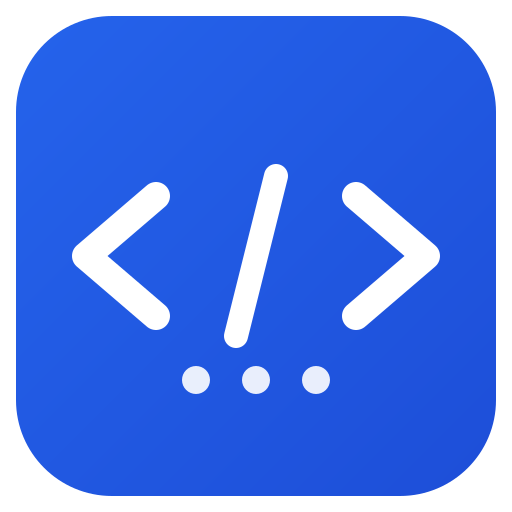

<p align="center">
  
</p>

# CodeCrew — 你的 AI 开发团队
<p align="center"></p>`n`n# CodeCrew — 你的 AI 开发团队

> 像指挥一个开发团队一样指挥 AI —— 有分工、有流程、有质检。
> 终端原生、多角色协作、权限可控的 AI 编程助手。

CodeCrew 是一个单文件 Go 程序：把 OpenAI 兼容的任意模型（DeepSeek / 通义千问 / Kimi / 智谱 / OpenAI / Ollama 本地模型）接进终端，用「角色 + 工具 + 权限闸门」的方式完成读代码、改代码、跑测试的真实工作。

---

## ✨ 核心特性

| 特性           | 说明                                                                          |
| -------------- | ----------------------------------------------------------------------------- |
| **角色化分工** | 内置 developer / reviewer / architect / tester / docs，工具白名单隔离权限     |
| **多模型通吃** | 一套配置兼容所有 OpenAI 兼容 API，含完全离线的 Ollama                         |
| **完整 Agent 循环** | 模型调用工具 → 结果回填 `role:"tool"` → 再次推理，直到给出最终答复       |
| **权限三档闸门** | allow / ask / deny 逐工具配置，破坏性命令强制二次确认，`--yes` 可全自动     |
| **流水线编排** | `/pipeline` 一键启动 architect 拆解 → developer 写 → reviewer 审 → tester 测 |
| **圆桌讨论** | `/roundtable` 多角色辩论 N 轮，输出共识、分歧与建议方案                       |
| **角色长期记忆** | 每角色独立 Markdown 笔记，自动注入 system prompt，`/memory` 管理             |
| **变更 diff 预览** | write / edit 前自动展示统一 diff（绿增红删），确认后才写入                  |
| **上下文自治** | token 预算可视、超限自动摘要压缩历史，长任务不再撑爆窗口                      |
| **会话持久化** | 每次对话落盘 JSONL，`/sessions`、`/resume`、`--session` 断点续聊             |
| **配置即代码** | 项目级 `codecrew.json` > 全局 `~/.codecrew/config.json` > 环境变量，热重载   |
| **推理范式增强** | standard / react / reflexion / cot 四种推理模式，ReAct 显式化，Reflexion 自我反思，失败经验自动积累 |
| **验证与自愈** | 代码修改后自动运行验证命令，失败时自动分析修复，多轮循环直到通过，支持自动检测项目类型 |
| **规划与执行** | 复杂任务先分解为 DAG 子任务，按依赖顺序逐步执行，失败时自动调整计划 |
| **记忆与知识** | 代码库索引（多语言符号提取）、BM25 语义检索、情景记忆，模型可搜索代码库 |
| **编排与评估** | Supervisor 多角色编排、Human-in-the-Loop 人工审批、Eval Harness 能力评估框架 |
| **Web 工作台** | 完整 Web 界面，10 个功能面板，桌面端/移动端自适应，SSE 流式输出 |
| **终端原生**   | 单二进制、零第三方依赖、跨平台（Linux / macOS / Windows），中英混排对齐       |

---

## 🚀 快速开始

### 1. 安装

```bash
# 从源码构建（要求 Go 1.22+，无其他依赖）
go build -o codecrew ./cmd/codecrew

# 或直接跑
go run ./cmd/codecrew

# 安装到 PATH（角色已内嵌进二进制，无需带 roles/ 目录）
go install ./cmd/codecrew
```

需要预编译二进制时，从 Releases 下载对应平台包。

### 2. 三步配置

```bash
cp codecrew.example.json codecrew.json   # 1) 复制模板
# 2) 编辑 codecrew.json，填入你的 API Key（以 DeepSeek 为例）
{
  "model": "deepseek/deepseek-chat",
  "providers": {
    "deepseek": {
      "base_url": "https://api.deepseek.com",
      "api_key": "sk-xxxxxxxx",            # ← 填这里
      "models": ["deepseek-chat", "deepseek-reasoner"]
    }
  }
}
./codecrew                                 # 3) 启动后输入 /reload
```

不想写配置文件时，用环境变量兜底：

```bash
export CREW_BASE_URL="https://api.deepseek.com"
export CREW_API_KEY="sk-xxxxxxxx"
export CREW_MODEL="deepseek-chat"
```

### 3. 开始用

```bash
$ ./codecrew --cwd ~/my-project
  当前模型: deepseek/deepseek-chat   工作目录: /home/me/my-project

developer → deepseek-chat
> 这个项目里所有 TODO 注释列一下
  🔧 grep pattern=TODO
     → 3 处命中（扫描 41 个文件）

developer → deepseek-chat
> 把第二处修掉，然后跑测试
  🔧 read path=internal/foo/bar.go
  🔧 edit path=internal/foo/bar.go old_text=...
  ⚠ 请求执行 bash: go test ./...
  允许？[y/N/a=always] a
     → ok  codecrew/internal/foo  0.42s
```

---

## 🎭 内置角色

| 角色          | 定位               | 授权工具                        | 适用场景                     |
| ------------- | ------------------ | ------------------------------- | ---------------------------- |
| `developer`   | 资深全栈开发工程师 | read glob grep write edit bash plan | 日常编码、重构、修 bug   |
| `reviewer`    | 严格的代码审查员   | read glob grep                  | 代码审查、规范检查（只读）   |
| `architect`   | 系统架构师         | read glob grep plan             | 方案设计、任务拆解（不改文件） |
| `tester`      | 测试工程师         | read glob grep write edit bash plan | 补测试、跑测试、按失败修复 |
| `docs`        | 技术文档工程师     | read glob grep write edit       | README、API 与架构文档       |

角色定义是 `frontmatter + Markdown`，随二进制内嵌；在 `roles/` 放同名 `.md` 即可覆盖，新增文件即新角色：

```markdown
---
name: security
description: 安全审计工程师，只读不写
tools: [read, glob, grep]
---

你是一名安全审计工程师。
- 优先看输入校验、权限判定、密钥处理、反序列化边界
```

```bash
./codecrew /role security     # 或交互中输入 /role security
```

---

## 🛠️ 工具体系

| 工具     | 作用                                            | 默认权限 |
| -------- | ----------------------------------------------- | -------- |
| `read`   | 带行号读文件，支持 `offset` / `limit` 分片      | allow    |
| `glob`   | 按通配模式找文件（`**/*.go`、`*.{md,txt}`）     | allow    |
| `grep`   | 正则搜索内容，带命中上下文与文件过滤            | allow    |
| `plan`   | 维护任务清单（add/update/list/done/clear）      | allow    |
| `write`  | 新建或整体覆盖文件，自动建父目录                | ask      |
| `edit`   | `old_text` 唯一匹配替换，多处命中即报错         | ask      |
| `bash`   | 跨平台执行命令（Windows 用 cmd/PowerShell，类 Unix 用 /bin/sh） | ask |

三层闸门依次判定：**角色白名单**（不在名单里 = deny，且不会下发给模型）→ **配置权限**（`permissions` / `/allow`）→ **交互确认**。命中破坏性特征（`rm -rf`、`git push --force`、`curl | sh`、`iex` 等）时无论怎么配置都会单独二次确认。

`write` / `edit` 执行前会自动展示**统一 diff 预览**（新增行绿色、删除行红色），确认后才真正写入文件，避免误改。

---

## 🤝 团队协作模式

### 流水线 `/pipeline <任务>`

一键启动四阶段自动化流水线，每个阶段独立运行 Agent 循环，结果自动传递给下一阶段：

```
architect 拆解任务 → developer 编码实现 → reviewer 代码审查 → tester 测试验证
```

```bash
> /pipeline 给用户模块增加密码重置功能
  ⚙ 启动流水线：给用户模块增加密码重置功能
  ── 阶段 1/4 · 架构师拆解任务
  ...（架构师读代码、输出设计与任务拆解）
  ── 阶段 2/4 · 开发工程师实现
  ...（开发者按拆解逐项实现、跑构建）
  ── 阶段 3/4 · 代码审查
  ...（审查者检查改动、输出问题清单）
  ── 阶段 4/4 · 测试验证
  ...（测试者跑测试、补测试、输出结果）
  ✓ 全部阶段完成
```

流水线结束后，完整的四阶段输出摘要会写入当前对话历史，可直接追问细节。

### 圆桌讨论 `/roundtable <话题> [轮数]`

architect / developer / reviewer 三个角色就同一话题辩论 N 轮（默认 2 轮，最多 5 轮），每轮每人基于之前所有发言给出自己的观点，最后由主持人输出：

- **共识**：所有角色都同意的结论
- **分歧**：角色之间的主要分歧点（注明谁支持、谁反对）
- **建议方案**：综合各方观点后的推荐行动

```bash
> /roundtable 这个项目要不要从单体迁移到微服务 3
  💬 圆桌讨论：这个项目要不要从单体迁移到微服务
  参与角色：architect · developer · reviewer
  讨论轮数：3 轮
  ── 第 1/3 轮
    ▸ architect ...
    ▸ developer ...
    ▸ reviewer ...
  ── 第 2/3 轮
    ...
  ── 主持人总结
  共识：...
  分歧：...
  建议方案：...
```

### 角色长期记忆 `/memory`

每个角色独立维护一份 Markdown 笔记，持久化到 `~/.codecrew/memory/<role>.md`。记忆会**自动注入到该角色的 system prompt 末尾**，切换角色时自动加载，让角色"记住"之前项目中的经验和决策。

```bash
> /memory                    # 查看当前角色的记忆
> /memory add 这个项目的测试用 httptest 起假服务  # 添加一条笔记
> /memory clear              # 清空当前角色的记忆
```

架构师可以记技术决策、测试员可以记常见坑点、开发者可以记项目约定——每个角色在后续对话中都会自动参考这些笔记。

---

## 🎮 命令一览

| 命令                              | 中文别名       | 说明                                       |
| --------------------------------- | -------------- | ------------------------------------------ |
| `/help`                           | `帮助`         | 显示命令列表                               |
| `/roles`                          | `角色`         | 列出角色及其工具白名单                     |
| `/role <name>`                    | —              | 切换角色（替换 system 提示词，不追加）     |
| `/model` / `/model <spec>`        | `模型`         | 查看 / 切换模型，spec 形如 `供应商/模型名` |
| `/config`                         | `配置`         | 供应商、密钥脱敏、权限档位、配置文件路径   |
| `/reload`                         | `重载`         | 重读配置并重建模型连接                     |
| `/tools` `/permissions` `/allow <tool>` | `工具` `权限` | 查看授权情况、临时放行某工具              |
| `/plan` `/plan <文字>`            | —              | 查看任务计划 / 手动加一条                  |
| `/pipeline <任务>`                 | `流水线`       | 四阶段流水线：架构师拆解→开发→审查→测试    |
| `/roundtable <话题> [轮数]`       | `圆桌`         | 多角色辩论 N 轮，输出共识与分歧             |
| `/memory` `/memory add <内容>` `/memory clear` | `记忆` | 查看 / 添加 / 清空当前角色的长期记忆 |
| `/context` `/compact`             | `上下文` `压缩` | 查看 token 占用 / 立即压缩历史             |
| `/clear` `/undo`                  | `清空` `撤销`  | 清空历史（保留角色）/ 回退上一轮           |
| `/sessions` `/resume <id>` `/new` | `会话` `恢复`  | 历史会话、续聊、新开会话                   |
| `/cost`                           | `成本`         | 本轮会话 token 与耗时统计                  |
| `/save` `/exit`                   | `保存` `退出`  | 手动落盘 / 退出                            |

命令行参数：

```
--role <name>     启动角色          --model <spec>   启动模型
--cwd <dir>       项目工作目录      --config <path>  指定配置文件
--session <id>    续聊历史会话      --print <text>   非交互单轮后退出
--yes             跳过交互确认      --no-color       关闭彩色输出
```

---

## ⚙️ 配置详解

优先级：`codecrew.json`（exe 同目录 → 当前目录）> `~/.codecrew/config.json` > 环境变量。多份文件的 `providers` 会合并，`model` 取更高优先级的一份。

```json
{
  "model": "qwen/qwen3-coder-plus",
  "providers": {
    "qwen": {
      "base_url": "https://dashscope.aliyuncs.com/compatible-mode/v1",
      "api_key": "sk-xxx",
      "models": ["qwen3-coder-plus", "qwen-max"]
    },
    "ollama": {
      "base_url": "http://localhost:11434/v1",
      "api_key": "ollama",
      "models": ["qwen2.5-coder:7b", "deepseek-r1:7b"]
    }
  },
  "permissions": { "*": "ask", "read": "allow", "glob": "allow", "grep": "allow", "plan": "allow" },
  "working_dir": "",
  "max_context_tokens": 24000,
  "max_tool_rounds": 12
}
```

| 键                    | 作用                                                       |
| --------------------- | ---------------------------------------------------------- |
| `permissions`         | 逐工具 `allow` / `ask` / `deny`，`*` 为兜底               |
| `working_dir`         | 文件类工具的根目录；相对路径以此为基准（也可 `--cwd`）     |
| `max_context_tokens`  | 超过即自动摘要压缩历史                                      |
| `max_tool_rounds`     | 单轮对话允许的工具调用轮数，防止失控循环                    |

环境变量：`CREW_BASE_URL`、`CREW_API_KEY`、`CREW_MODEL`、`CREW_WORKING_DIR`、`CREW_MAX_CONTEXT_TOKENS`、`CREW_DEFAULT_PERMISSION`。密钥只从配置/环境读取，`/config` 一律脱敏展示。

> 会话记录写在 `~/.codecrew/sessions/*.jsonl`，包含完整对话与工具结果，请按项目需要自行管理敏感信息。

---

## 🧱 架构

```
cmd/codecrew/          # CLI 入口与参数
internal/
├── repl/              # 交互层：命令解析、Agent 循环、权限确认、上下文压缩、流水线、圆桌
├── config/            # 分层配置、供应商解析、权限档位、密钥脱敏
├── role/              # 角色加载（内嵌默认为底，磁盘可覆盖）与 frontmatter 解析
│   └── defaults/      # 内置角色 .md（go:embed）
├── llm/               # OpenAI 兼容客户端：SSE 流式、tool_calls 按槽位归并
├── tool/              # 工具注册表 + read/write/edit/bash/glob/grep/plan + diff 预览
├── memory/            # 角色长期记忆：Markdown 笔记持久化、自动注入 system prompt
├── session/           # 会话 JSONL 落盘与续聊
└── disp/              # 终端显示宽度（中英混排对齐）
```

依赖方向自上而下，`internal/*` 之间不出现反向依赖；`tool` 只依赖 `llm` 的数据结构做摘要。

---

## 🧪 测试与构建

```bash
go test ./...            # 单元 + 集成测试（集成测试内置一个假的 OpenAI 兼容服务）
go test ./... -race      # 竞态检查
go vet ./...
gofmt -l .               # 应无输出
```

`internal/repl` 的测试会拉起 `httptest` 假模型服务，完整验证「用户输入 → 流式 tool_calls → 权限闸门 → 工具执行 → 结果回填 → 二次推理」的闭环，不需要任何真实 API Key。

---

---

## 🤝 贡献

1. 遵循分层架构，`internal/*` 不出现反向依赖
2. 新工具：实现 `tool.Tool`，在 `tool.NewDefaultRegistry` 注册并声明默认权限档
3. 新角色：放进 `internal/role/defaults/*.md`（内置）或 `roles/*.md`（用户覆盖）
4. 提 PR 前：`gofmt -l .` 无输出、`go vet ./...` 与 `go test ./... -race` 全绿，新逻辑带测试

---

## 📄 许可证

Apache License 2.0，详见 [LICENSE](LICENSE)。


